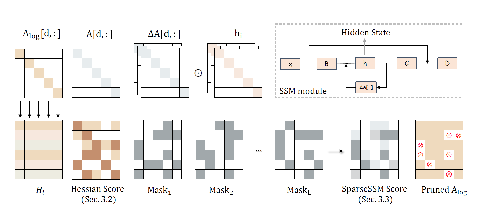
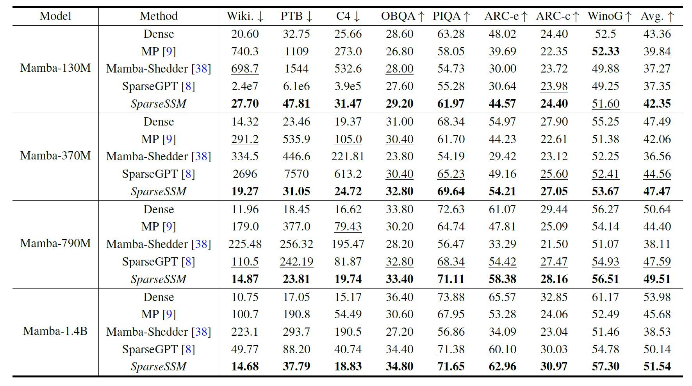
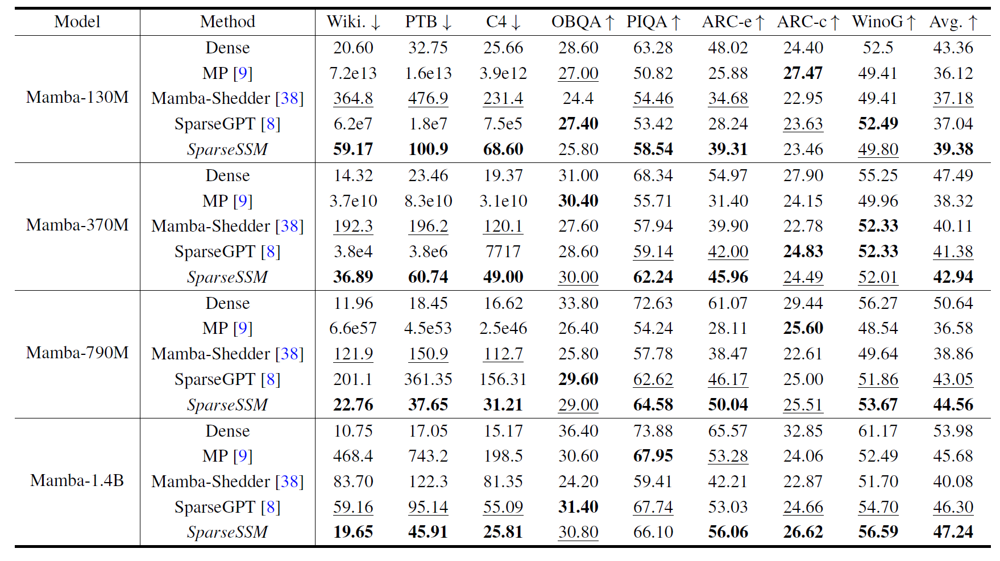

<p align="center">
 <br>
</p>

<div align="center">
<h1>SparseSSM</h1>
  <div align="center">
  <a href="https://opensource.org/licenses/Apache-2.0">
    
  </a>
  <a href="https://github.com/state-spaces/mamba">
    
  </a>
  </div>
  <p align="center">
    <h3>Efficient Selective Structured State Space Models Can Be Pruned in One-Shot</h3>
</p>
</div>


State-space language models such as Mamba match Transformer quality while permitting linear complexity inference, yet still comprise billions of parameters that hinder deployment. Existing one-shot pruning methods are tailored to attention blocks and fail to account for the time-shared and discretized state-transition matrix at the heart of the selective state-space module (SSM). In this paper, we introduce ***SparseSSM***, the first training-free pruning framework that extends the classic optimal brain surgeon (OBS) framework to state space architectures. Our layer-wise algorithm **(i)** derives an approximate second-order saliency score that aggregates Hessian-trace information across time steps,  **(ii)** incorporates a component sensitivity analysis to guide feed-forward network (FFN) pruning, which also sheds light on where redundancy resides in mamba architecture,  **(iii)** can be easily extended to semi-structured and structured sparsity. Empirically, we prune 50% of SSM weights without fine-tuning and observe no zero-shot accuracy loss, achieving the current state-of-the-art pruning algorithm for Mamba-based LLMs.

> **SparseSSM: Efficient Selective Structured State Space Models Can Be Pruned in One-Shot** [[arXiv]](https://arxiv.org/abs/2506.09613)
> *[Kaiwen Tuo](https://cfintech.github.io/), [Huan Wang](https://huanwang.tech/)*


## 🚀Quick Start

### 1. Install environment

```bash
git clone https://github.com/CFinTech/SparseSSM.git 
cd SparseSSM
pip install -r requirements.txt
```

### 2. Download dataset

The data for calibrations can be downloaded [here](https://huggingface.co/datasets/mindchain/wikitext2).

### 3. Execute

To prune the SSM module:

```bash
CUDA_VISIBLE_DEVICES=${your_gpu_id} python main.py \
  path/to/your/model wikitext2 \
  --experiment_name your_experiment_name\
  --method "sparsessm" \
  --save path/to/pruned_model \
  --sparsity 0.5 \
  --nsamples 64 \
  --minlayer 0 \
  --maxlayer 100 \
  --prune_A True \
  --log_wandb \
```

To prune the FFN components:

```bash
CUDA_VISIBLE_DEVICES=${your_gpu_id} python main.py \
  path/to/your/model wikitext2 \
  --experiment_name your_experiment_name\
  --method "sparsessm" \
  --save path/to/pruned_model \
  --sparsity 0.5 \
  --nsamples 64 \
  --minlayer 0 \
  --maxlayer 100 \
  --blocksize 128 \
  --target_modules "nn.Conv1d" "nn.Linear" \
  --prune_layer True \
  --alpha 0.04 \
  --log_wandb \
```


## 🖼️ Method Overview



Illustration of SparseSSM. The **first row** depicts the evolution of the diagonal parameter matrix $A_{log}$ within the SSM module in Mamba, together with a schematic of the forward-propagation process. In the **second row**, the **left panel** shows the procedure for obtaining a mask from the Hessian estimate at a single time step, while the **right pane** l presents our strategy for merging the masks across all time steps.

## 📊 Comparison of Experimental Results

Performance analysis for one-shot unstructured pruning of SSM modules in Mamba models (130M $\sim$ 1.4B) at $50\%$ sparsity.



Performance analysis for one-shot unstructured pruning of the whole Mamba models (130M $\sim$ 1.4B) at $50\%$ sparsity. 



## 🙏 Acknowledgements

- This source code is derived from the famous PyTorch reimplementation of [SparseGPT](https://github.com/IST-DASLab/sparsegpt) and [mamba-minimal](https://github.com/johnma2006/mamba-minimal).
- We use [Mamba checkpoints](https://huggingface.co/state-spaces) to test our method.
- The README file is inspired by [LLM-pruner](https://github.com/horseee/LLM-Pruner).


## Citation

If you find this work useful for your research, please consider citing our paper:

```
@article{tuo2025sparsessm,
  title={SparseSSM: Efficient Selective Structured State Space Models Can Be Pruned in One-Shot},
  author={Kaiwen Tuo and Huan Wang},
  journal={arXiv preprint arXiv:2506.09613},
  year={2025},
}
```

